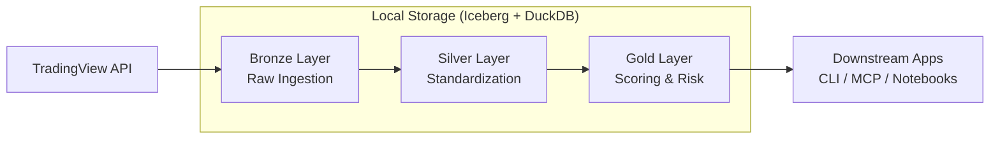

# Medallion Lakehouse Architecture

This project follows a **Medallion Architecture** to manage the data lifecycle from raw TradingView API responses to high-quality, actionable trading signals.

## Data Flow Overview



## Layers

### 1. Bronze (Raw Ingestion)
- **Source**: Directly from `tvscreener` library calls to TradingView.
- **Content**: Raw, unformatted JSON/Dictionary data converted to DataFrames.
- **Storage**: Appended to Iceberg tables with `ingest_date` partitioning.
- **Purpose**: Data lineage and "replay" capability. If logic changes, we can re-process from Bronze without hitting the API.

### 2. Silver (Standardization)
- **Source**: Bronze layer or fresh ingestion.
- **Content**: Canonical column names (e.g., `CLOSE`, `VOLUME`), standardized asset identifiers (e.g., `EURUSD` instead of `FX:EURUSD`), and basic technical indicators.
- **Storage**: Overwritten or appended to Iceberg tables with `asset_type` partitioning.
- **Purpose**: Clean, high-performance dataset for analysis. Enables cross-asset queries.

### 3. Gold (Scoring & Serving)
- **Source**: Silver layer.
- **Content**: Calculated confluence scores, trend strength, volatility metrics, and risk management parameters (Stop Loss, Take Profit, Position Sizing).
- **Storage**: Finalized results ready for consumption.
- **Purpose**: Actionable signals. This is what the user sees in the CLI and MCP tools.

## Technology Stack

- **Table Format**: [Apache Iceberg](https://iceberg.apache.org/) (via `pyiceberg`) for transactional consistency and time-travel.
- **Storage Backend**: Local Parquet files organized by the Iceberg spec.
- **Query Engine**: [DuckDB](https://duckdb.org/) for lightning-fast OLAP queries on the Edge.
- **Lazy Processing**: [Narwhals](https://github.com/narwhals-dev/narwhals) for agnostic, lazy-evaluated transformations that work across Pandas, Polars, and DuckDB.

## Time Travel & Replay

Since we use Iceberg, we can query historical snapshots of our data:

```python
from tvscreener.lib.query import EdgeQueryClient

with EdgeQueryClient() as client:
    # Query a specific historical snapshot
    df = client.query_sql("forex.opportunities", "SELECT * FROM df", snapshot_id=123456789)
```

## Maintenance

Lakehouse maintenance can be performed via the CLI:

```bash
tvscreener-scan maintenance --expire-snapshots --days 7 --table forex.opportunities
```
