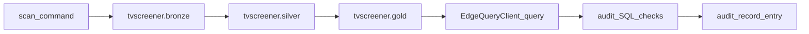

# [LEGACY DOCUMENTATION]

> **Note**: This document is preserved for historical context. Its contents may refer to deprecated directories (`workflows/`, `semantic/`, `todos/`) or outdated architectural patterns. For the current authoritative project specification, refer to `docs/openspec/project.md` and `docs/architecture/`.

---

## Context
The project uses a local Iceberg lakehouse to persist TradingView scan outputs as medallion tables:
Bronze (raw ingestion), Silver (standardization + identity), and Gold (features/signals for serving).

Historically, the project also produced repository-local snapshots (commonly under `exports/`).
Those artifacts are not transactional, can drift from the lakehouse, and encourage audits that are
not reproducible.

## Goals / Non-Goals

### Goals
- Make Iceberg tables the default and only default audit source.
- Make optional on-disk snapshots explicitly intentional and never required for correctness.
- Provide an audit runbook template that records:
  - the scan commands used
  - `run_id`/`fetched_at_utc`/`timeframe_set_id`
  - Iceberg `snapshot_id`s for Bronze/Silver/Gold
  - SQL used for spot checks
- Align multi-asset planning docs with current code behavior and clearly separate “current” vs
  “proposed”.

### Non-Goals
- Full long-form (timeframe-as-dimension) table migration.
- Introducing a workflow engine or shared catalog backend (Postgres) in this change.
- Retrofitting historical audits or backfilling old tables.

## Decisions

### Decision: Iceberg is canonical; snapshots are optional artifacts
- Iceberg tables (`tvscreener.bronze`, `tvscreener.silver`, `tvscreener.gold`) are the canonical
  audit dataset.
- Optional snapshots MAY be written by operators, but audits MUST NOT require them.
- Any docs/examples referencing repository-local snapshots should be rewritten to prefer Iceberg.

### Decision: Separate “audit record” from “runbook”
- The runbook describes *how to run* audits.
- The audit record is a structured log of *what was run and what was observed*.

### Decision: Keep optional snapshots location flexible
- Operators can write on-disk outputs to a user-chosen path under the working directory.
- The project SHOULD avoid treating a single repo folder name (historically `exports/`) as part of
  the default workflow.

## Data Flow (audit-oriented)

## Risks / Trade-offs
- Removing repository-local snapshots from docs may slow ad-hoc debugging for some users who rely
  on “file-first” workflows. Mitigation: provide explicit “Optional snapshots” steps and examples.
- If the codebase still defaults to writing caches/snapshots in repo-local directories, docs will be
  misleading. Mitigation: include follow-up code tasks to enforce the policy.

